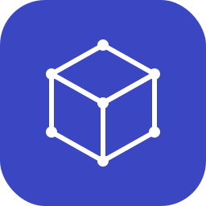

# Edge Impulse → Unity Sentis Custom Deployment Block



A [custom deployment block](https://docs.edgeimpulse.com/studio/organizations/custom-blocks/custom-deployment-blocks)
for Edge Impulse Enterprise organizations that builds a **Unity Sentis-ready
`deploy.zip`** for any Unity project — Quest 2 / Quest 3 / mobile XR / desktop.

## What it does

When triggered from any project in your organization:

1. Reads the project's trained TFLite model + impulse metadata.
2. Converts TFLite → ONNX with `tflite2onnx` (no TensorFlow dep).
3. Picks the C# DSP extractors that match the impulse's DSP block types.
   The extractors are **general implementations** — any impulse using that
   block, regardless of sensor type, gets a working extractor.
4. Bundles a `metadata.json` with class names, sensor type, sample rate, and
   the DSP block parameters — so the client-side preprocessing matches
   exactly what the model was trained on.

```
deploy.zip
├── model.onnx              ← Unity Sentis loads this directly
├── metadata.json           ← classes, DSP params, sensor info
├── README.md
├── unity/Scripts/          ← only the extractor(s) this impulse uses
│   ├── Fft.cs                                (always, dependency of the others)
│   ├── SpectralAnalysisExtractor.cs          (impulses with Spectral Analysis)
│   ├── MFEExtractor.cs                       (impulses with Audio MFE)
│   └── MFCCExtractor.cs                      (impulses with Audio MFCC)
└── (optional) eon/         ← EON-compiled .h/.cpp if --include-eon yes
```

Each `.cs` extractor handles **any impulse using that DSP block**, with all
parameters (sample rate, frame size, filter count, FFT length, etc.) read
at runtime from `metadata.json`. The selection is "include `MFEExtractor.cs`
in the zip when the impulse has an Audio MFE block" — not "this build is
audio-specific".

## Why this exists

EI doesn't expose ONNX as a deploy block for most projects, and the TFLite
it does expose is just the neural net (DSP block runs separately in EI's
C++ code). Without this block, a Unity Sentis consumer has to:

1. Pick a TFLite-bearing deploy (`arduino` / `android-cpp` / `wasm`).
2. Extract the embedded TFLite from the C byte-array inside the zip.
3. Run `tflite2onnx` somewhere (server-side function or a one-off CLI).
4. Hand-write or copy in C# DSP code matching the impulse.

This block does steps 1–4 inside EI's infrastructure and hands you a
self-contained zip you drop into Unity.

## Drop-in usage in any Unity Sentis project

After downloading the `deploy.zip` produced by this block (paths below are
inside that zip — they don't exist in this repo):

1. Add `com.unity.sentis` to `Packages/manifest.json` (Unity 6 LTS or later).
2. Extract `unity/Scripts/*.cs` from the zip into your project's
   `Assets/Scripts/`.
3. Drop `model.onnx` into `Assets/Resources/Models/` (or load via stream
   from disk if it's user-supplied).
4. Read `metadata.json` at runtime to configure the DSP extractor's
   parameters (frame size, FFT length, num filters, etc.) so client-side
   preprocessing matches what the model was trained on.

> **Where the C# scripts come from:** they're checked in here under
> [`unity-dsp/`](unity-dsp/). Canonical source still lives in
> [`yennster/ei-vr-explorer-unity`](https://github.com/yennster/ei-vr-explorer-unity/tree/main/Assets/Scripts);
> when those upstream files change, run `./tools/sync-from-unity.sh` and
> commit the diff. The Dockerfile just `COPY`s the snapshot — deterministic
> builds, no network needed at image build time.

## Install (Enterprise)

Custom deployment blocks are an **Enterprise-only** Edge Impulse feature.
The canonical way to publish one is the `edge-impulse-blocks` CLI.

### Push to your org with the EI CLI

```bash
# One-time: install the CLI globally
npm install -g edge-impulse-cli

# Clone this repo (or your fork) and cd into it
git clone https://github.com/yennster/ei-unity-sentis-block.git
cd ei-unity-sentis-block

# One-time: link the directory to a new org block.
# Asks which organization, the block's display name, and category.
# Generates .ei-block-config in the cwd.
edge-impulse-blocks init

# Upload the source, build the Docker image in EI's infrastructure,
# and register the block in your org. Re-run after any local change.
edge-impulse-blocks push
```

#### Recommended answers to `edge-impulse-blocks init` prompts

The CLI will walk you through several questions. Use these answers for
this block — they match the existing `parameters.json` and the assumptions
in `build.py`:

| Prompt | Answer | Why |
|---|---|---|
| **Block name** | `Unity Sentis (ONNX + C# DSP bundle)` | What appears in Studio's deploy picker. |
| **Type / category** | `library` | This block produces a downloadable artifact, not firmware. |
| **Integration URL** | `https://github.com/yennster/ei-unity-sentis-block` | Studio shows this link to users after a successful deploy ("what do I do with this zip?"). |
| **CLI arguments** | *(empty)* | All build-time options are declared in `parameters.json`; no static args needed. |
| **Mount learn-block output under `/data`?** | **N** | We only need the trained TFLite + impulse metadata, not raw training samples. |
| **Support the EON Compiler?** | **N** | EON Compiler emits a custom binary that isn't standard TFLite — `tflite2onnx` can't parse it. Forcing standard TFLite keeps conversion reliable. |
| **Show optimizations panel?** | **Y** (default) | Lets the user pick `int8` vs `float32` in Studio's UI; our build picks the matching variant from `metadata.tfliteModels[]`. |

If you've already typed something different, no harm done — re-run
`edge-impulse-blocks init` to overwrite, or edit `parameters.json` and
`.ei-block-config` directly.

After `push`, the block appears under your organization's
**Custom blocks** and is selectable on the **Deployment** page of any
project in the org as **"Unity Sentis (ONNX + C# DSP bundle)"**.

### Updating the block after a code change

`edge-impulse-blocks push` is the workflow for any change — `build.py`,
`Dockerfile`, `parameters.json`, the `unity-dsp/` snapshot, anything:

```bash
# Edit your files, commit if you want
git add -A && git commit -m "..."

# Re-upload + rebuild in EI's infrastructure
edge-impulse-blocks push
```

`push` uploads the new source, rebuilds the Docker image server-side, and
updates the block record in your org. Existing projects that have the
block as a deploy target automatically pick up the new version on their
next deploy — no re-init required, and consumers don't need to re-link.

If you want to force a project to re-fetch the latest, just hit Build
again on its Deployment page.

### Block icon

This repo ships an icon under [`images/`](images/) — a purple isometric
cube on the EI brand color (`#3b47c2`):

- `images/icon.svg` — primary, scalable
- `images/icon.png` — 256×256 raster (regenerate with
  `qlmanage -t -s 256 -o images images/icon.svg && mv images/icon.svg.png images/icon.png`)

The `edge-impulse-blocks` CLI doesn't currently push an icon as part of
`push`, so upload it once via Studio UI:

**Organizations → Custom blocks → \<your block\> → Edit → Logo → Upload**

### Test locally before pushing

The CLI ships a runner that downloads real project data and executes the
block exactly as Studio would:

```bash
edge-impulse-blocks runner
# Creates ./ei-block-data/{downloads,input,output} and runs the container.
ls ei-block-data/output/   # → deploy.zip
unzip -l ei-block-data/output/deploy.zip
```

### Alternative: build the Docker image yourself

If you already have the image in your own registry (Docker Hub, GHCR, etc.),
in Studio: **Organizations → Custom blocks → Add → Deployment block** and
point it at the image instead of using the CLI.

## Local testing

The fastest way is `edge-impulse-blocks runner` (above) — it pulls real
project data and runs the container with the right metadata wired up.

To exercise the raw Docker image directly:

```bash
docker build -t ei-unity-sentis-block .

# After running `edge-impulse-blocks runner --download-data input/` once,
# you have a real deployment-metadata.json on disk:
docker run --rm \
  -v "$PWD/ei-block-data:/data" \
  ei-unity-sentis-block \
  --metadata /data/input/deployment-metadata.json \
  --quantization float32 \
  --include-eon no

ls ei-block-data/output/   # → deploy.zip
unzip -l ei-block-data/output/deploy.zip
```

## Block parameters (parameters.json)

| Parameter | Default | Meaning |
|---|---|---|
| `quantization` | `float32` | Which TFLite variant to convert. `int8` works if the project has int8 quant available; Sentis loads both. |
| `include-eon` | `no` | Bundle the EON-compiled `.h/.cpp` headers alongside the ONNX. Optional — useful for native plugin paths. |

## Updating the bundled C# scripts

The four `.cs` files in [`unity-dsp/`](unity-dsp/) are committed copies of
the canonical source in `yennster/ei-vr-explorer-unity`. Refresh them when
upstream changes:

```bash
./tools/sync-from-unity.sh             # default: main
./tools/sync-from-unity.sh <commit>    # or pin to a specific commit/tag
git diff unity-dsp/                    # review
git commit unity-dsp/ -m "Sync unity-dsp from ei-vr-explorer-unity@<ref>"
```

Each Docker build then ships exactly that snapshot — fully deterministic.

## Companion repos

- Unity reference app (Quest 2, includes scenes + collect/retrain UI):
  <https://github.com/yennster/ei-vr-explorer-unity>
- Web companion (pairing UI + fallback TFLite→ONNX path for non-Enterprise users):
  <https://github.com/yennster/ei-vr-explorer-web>

## License

MIT.
